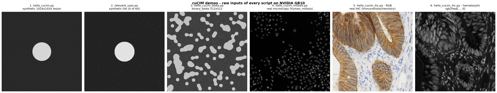
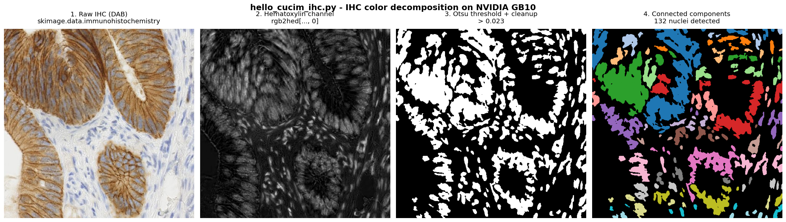

# RAPIDS-cuCIM

[cuCIM](https://github.com/rapidsai/cucim) — GPU-accelerated computer vision and image processing in the RAPIDS SDK. Scikit-image–compatible API on top of CuPy, plus a `CuImage` loader for TIFF / OME-TIFF / SVS / DICOM straight to device memory.

## Install

```bash
# pip
pip install --extra-index-url=https://pypi.nvidia.com cucim-cu12   # or cucim-cu13

# conda
conda create -n rapids -c rapidsai -c conda-forge -c nvidia \
    cucim=26.04 python=3.13 cuda-version=13.0 && conda activate rapids

# docker — see examples/Dockerfile (multi-arch RAPIDS base, builds on x86_64 + aarch64)
```

Requires Linux + CUDA 12 (driver ≥ 525) or CUDA 13 (driver ≥ 580), GPU with CC ≥ 7.0.

## Examples

[`examples/`](./examples) — six runnable scripts + reproducible Dockerfile. Setup + per-script commands in [`examples/README.md`](./examples/README.md).

| Script | What it does |
|---|---|
| `install_verification.py` | Smoke test (CUDA + cuCIM import + 1 GPU op). |
| `hello_cucim.py` | Synthetic 1024² lesion → Gaussian → threshold → label. |
| `relevant_uses.py` | N synthetic pathology tiles → 4-stage GPU pipeline → tiles/sec. |
| `hello_cucim_blobs.py` | `binary_blobs` + noise → same pipeline (non-circular geometry). |
| `hello_cucim_mitosis.py` | Real microscopy (`human_mitosis`) → Otsu → nuclei count. |
| `hello_cucim_ihc.py` | Real IHC (`immunohistochemistry`) → `rgb2hed` → Otsu → nuclei. |

## Results

Same `cucim==26.04.00`, two GPU platforms, two architectures, two install paths. Full captures: [`screenshots/brev_l4_results.md`](./screenshots/brev_l4_results.md) · [`screenshots/dgx_spark_results.md`](./screenshots/dgx_spark_results.md).

| | Brev L4 (Ada, x86_64, CUDA 12, Docker) | DGX Spark GB10 (Blackwell, aarch64, CUDA 13, Conda) |
|---|---|---|
| `install_verification.py` | PASS | PASS |
| `hello_cucim.py` | 1 region | 1 region |
| `relevant_uses.py` 64 tiles | 8.74 tiles/sec | 112.75 tiles/sec |
| `relevant_uses.py` 128 tiles | 17.03 tiles/sec | **679.86 tiles/sec** |

**GB10 vs L4: ~12.9× at 64 tiles, ~39.9× at 128 tiles.** Identical region/nucleus counts across platforms; only throughput moves with the hardware.

Every demo's raw input (GB10):



IHC color decomposition pipeline — `rgb2hed` on the GPU, Otsu on the hematoxylin channel, 132 nuclei detected:



## First Bowl of Soup — Digital pathology preprocessing

WSI tile reads + filter + threshold + morphology + label, all GPU-resident, no PCIe round-trip per tile. cuCIM already backs `MONAI WSIReader(backend='cucim')`, and NVIDIA Clara / Holoscan reference it as the recommended image-processing layer. [`examples/relevant_uses.py`](./examples/relevant_uses.py) demonstrates the same shape at small scale.

## Links

[Docs](https://docs.rapids.ai/api/cucim/stable/) · [Install matrix](https://docs.rapids.ai/install/) · [Source](https://github.com/rapidsai/cucim) · [MONAI WSIReader](https://docs.monai.io/en/stable/data.html#wsireader)

## Contributor

[Julio Casal](https://github.com/jcasalmo)
