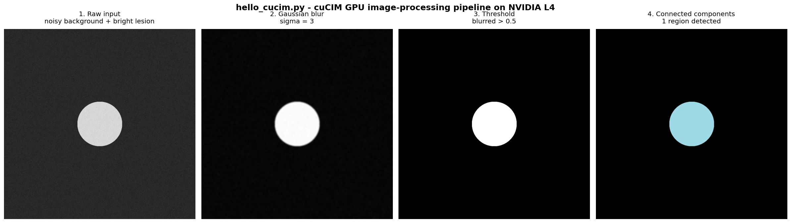
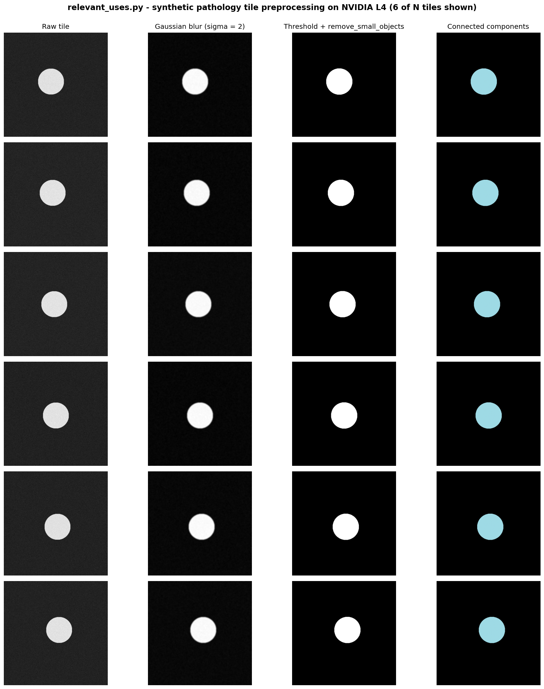

# Brev L4 — cuCIM Run Outputs

Sanitized capture of every example in `RAPIDS-cuCIM/examples/` running end-to-end on a Brev L4 GPU instance.

## Environment

| | |
|---|---|
| Provider | Brev (Scaleway L4) |
| GPU | NVIDIA L4 (24 GB VRAM, compute capability 8.9) |
| Driver | 550.107.02 (CUDA 12.4 reported by `nvidia-smi`) |
| Container | `nvcr.io/nvidia/rapidsai/base:26.04-cuda12-py3.13` |
| cuCIM | 26.04.00 |
| CuPy | 14.0.1 |
| CUDA runtime (in container) | 12.9 |
| Date | 2026-05-21 (UTC) |

## 1. `install_verification.py`

```text
cuCIM version: 26.04.00
CuPy version: 14.0.1
CUDA runtime: 12.9
GPU 0: NVIDIA L4 (compute 8.9)
PASS: cuCIM is installed and the GPU image workflow is working.
```

## 2. `hello_cucim.py`

```text
Hello cuCIM
Input type: <class 'cupy.ndarray'>
GPU device: NVIDIA L4
Image shape: (1024, 1024)
Detected regions: 1
```

The four stages of the GPU pipeline, rendered from the actual `cucim.skimage` arrays:



## 3. `relevant_uses.py` — default (64 tiles, 512×512)

```text
cuCIM First Bowl of Soup demo
GPU device: NVIDIA L4
Tiles processed: 64
Tile size: 512 x 512
Detected regions: 64
Elapsed preprocessing time: 7.321 seconds
Throughput: 8.74 tiles/second
```

## 4. `relevant_uses.py` — 128 tiles, 512×512

```text
cuCIM First Bowl of Soup demo
GPU device: NVIDIA L4
Tiles processed: 128
Tile size: 512 x 512
Detected regions: 128
Elapsed preprocessing time: 7.517 seconds
Throughput: 17.03 tiles/second
```

A visual sample of 6 of the N synthetic pathology tiles, each shown at all four preprocessing stages (raw → blurred → threshold + cleanup → connected components):



## Individual stage PNGs

Every image at every stage is also saved as a standalone PNG (no titles, no axes — just the actual GPU-processed array, colormapped only for the binary masks and label images).

- [`hello_cucim/`](./hello_cucim) — 4 PNGs (1024×1024) of the single-image pipeline:
  - `01_raw.png` · `02_blurred.png` · `03_thresholded.png` · `04_labels.png`
- [`relevant_uses/`](./relevant_uses) — 24 PNGs (512×512) covering 6 tiles × 4 stages, named `tile_<i>_<stage>.png`:
  - stages: `01_raw` → `02_blurred` → `03_thresholded` → `04_labels`
  - tiles: `tile_0` through `tile_5`

Use these in the slide deck when you want a single isolated frame instead of the composite grid.

## Notes

- All four scripts completed with `exit_code: 0` end-to-end inside the container.
- Throughput nearly doubled from the 64-tile run to the 128-tile run (8.74 → 17.03 tiles/sec) with effectively the same wall-clock time — i.e. the per-batch overhead (synthetic tile generation + GPU launch setup) dominates at small batch sizes, and the per-tile preprocessing scales sub-linearly with batch size. This is the same scaling profile that real digital-pathology pipelines benefit from when batching many tile reads per whole-slide image.
- A benign `get_mempolicy: Operation not permitted` line was printed by the container at startup (NUMA syscall blocked inside the container, harmless and unrelated to cuCIM).
- `relevant_uses.py` emitted a `FutureWarning` about `morphology.remove_small_objects(..., min_size=...)` being deprecated in cuCIM 26.04 in favor of `max_size=`. The script still runs correctly; the parameter will be removed in cuCIM 26.12 or later.

## Reproduce

From the repo root:

```bash
cd RAPIDS-cuCIM/examples
docker build -t cucim-hello .

docker run --rm --gpus all cucim-hello                                          # install_verification.py
docker run --rm --gpus all cucim-hello python hello_cucim.py                    # hello cuCIM
docker run --rm --gpus all cucim-hello python relevant_uses.py                  # 64 tiles, 512x512
docker run --rm --gpus all cucim-hello python relevant_uses.py --tiles 128      # 128 tiles, 512x512
```
