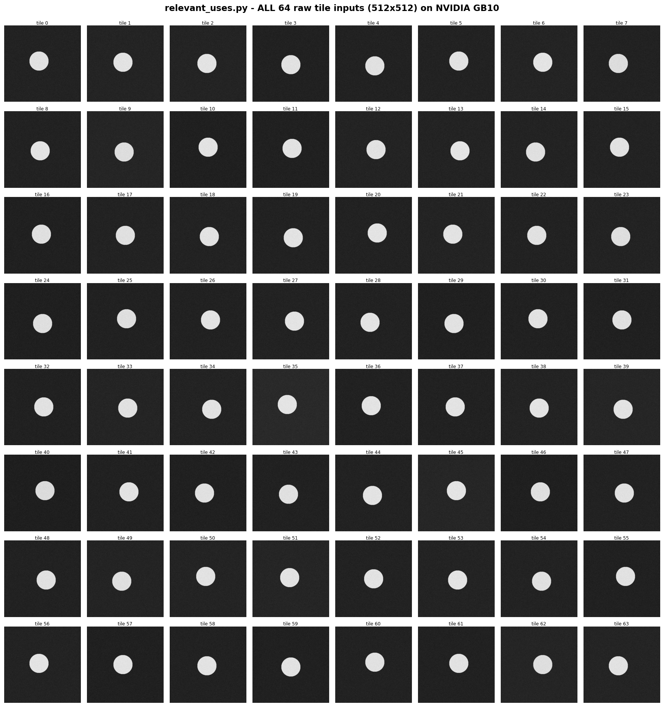
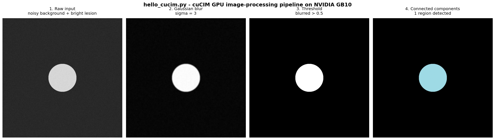
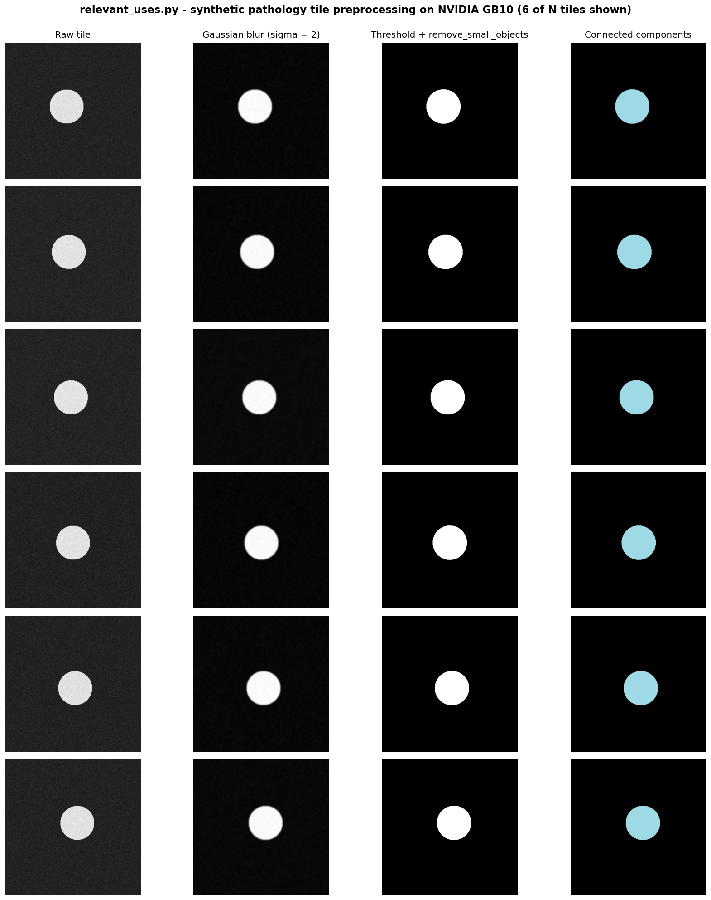
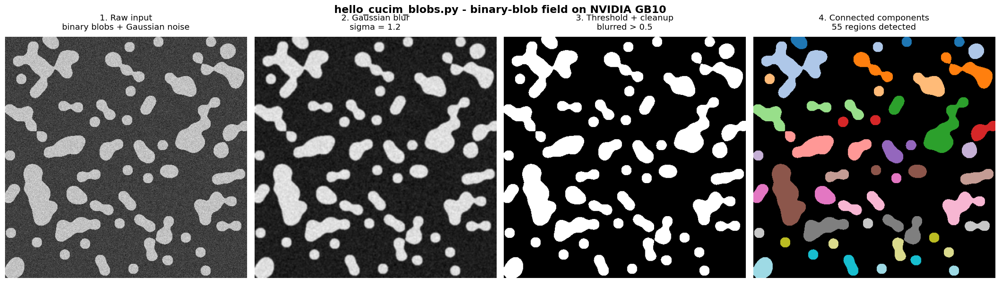
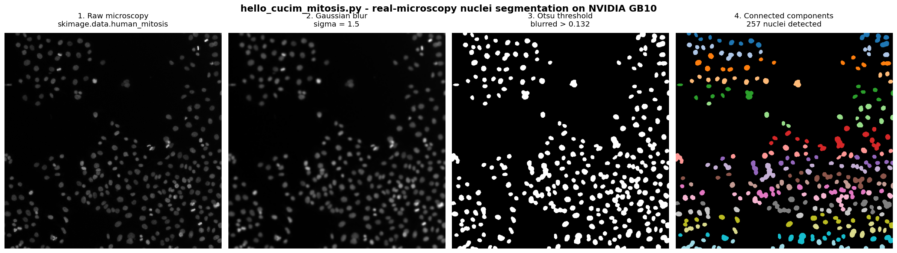

# DGX Spark — cuCIM Run Outputs

Sanitized capture of every example in `RAPIDS-cuCIM/examples/` running end-to-end on an NVIDIA DGX Spark workstation.

## At-a-glance: every demo's raw input


The six panels are the actual GPU arrays each demo starts from: synthetic `hello_cucim.py` lesion (1024×1024), a single `relevant_uses.py` tile (512×512), `binary_blobs` (512×512), the real `human_mitosis` microscopy crop (512×512), the real IHC RGB image (512×512×3), and the hematoxylin channel that the IHC demo extracts via `rgb2hed`.

## All 64 `relevant_uses.py` tile raw inputs



Every one of the 64 synthetic tiles that `relevant_uses.py --tiles 64` actually processes, shown as the raw GPU input before any Gaussian / threshold / morphology / label step. Look closely: each tile's bright "lesion" is offset by a few pixels (and tiles ~32–36 have a slightly different center) — that controlled variation is what gives the timing run a non-trivial workload while keeping the region count predictable.

## Environment

| | |
|---|---|
| Provider | NVIDIA DGX Spark (Standalone Spark 01, in-lab) |
| GPU | NVIDIA GB10 (Grace-Blackwell desktop, compute capability 12.1) |
| Architecture | `aarch64` (ARM Neoverse V2) |
| OS | Ubuntu 24.04.3 LTS, kernel `6.14.0-1015-nvidia` |
| Driver | 580.95.05 (CUDA 13.0 reported by `nvidia-smi`) |
| Install path | **Conda env** at `~/cucim-env` (the DGX Spark user is not in the `docker` group; the Docker path on Brev exercises the same cuCIM version) |
| cuCIM | 26.04.00 (cuda13 build) |
| CuPy | 14.0.1 |
| CUDA runtime (in env) | 13.1 |
| Python | 3.13.13 |
| Date | 2026-05-21 (UTC) |

Conda env recipe used here:

```bash
mamba create -y --prefix ~/cucim-env \
    -c rapidsai -c conda-forge -c nvidia \
    cucim=26.04 python=3.13 cuda-version=13.0 \
    cupy matplotlib scikit-image numpy pillow pooch
```

## 1. `install_verification.py`

```text
cuCIM version: 26.04.00
CuPy version: 14.0.1
CUDA runtime: 13.1
GPU 0: NVIDIA GB10 (compute 12.1)
PASS: cuCIM is installed and the GPU image workflow is working.
```

## 2. `hello_cucim.py`

```text
Hello cuCIM
Input type: <class 'cupy.ndarray'>
GPU device: NVIDIA GB10
Image shape: (1024, 1024)
Detected regions: 1
```

The four stages of the GPU pipeline, rendered from the actual `cucim.skimage` arrays on the GB10:



## 3. `relevant_uses.py` — default (64 tiles, 512×512)

```text
cuCIM First Bowl of Soup demo
GPU device: NVIDIA GB10
Tiles processed: 64
Tile size: 512 x 512
Detected regions: 64
Elapsed preprocessing time: 0.568 seconds
Throughput: 112.75 tiles/second
```

## 4. `relevant_uses.py` — 128 tiles, 512×512

```text
cuCIM First Bowl of Soup demo
GPU device: NVIDIA GB10
Tiles processed: 128
Tile size: 512 x 512
Detected regions: 128
Elapsed preprocessing time: 0.188 seconds
Throughput: 679.86 tiles/second
```

A visual sample of 6 of the N synthetic pathology tiles, each shown at all four preprocessing stages (raw → blurred → threshold + cleanup → connected components):



### Speedup vs Brev L4 (same demo, same RAPIDS release)

| Batch | Brev L4 | DGX Spark GB10 | **Speedup** |
|---|---|---|---|
| 64 tiles | 8.74 tiles/sec | 112.75 tiles/sec | **~12.9×** |
| 128 tiles | 17.03 tiles/sec | 679.86 tiles/sec | **~39.9×** |

The GB10's combination of Blackwell-class FP32 throughput and unified high-bandwidth memory absorbs the per-batch overhead that dominated the L4 run, so the workflow becomes throughput-bound at 128 tiles where the L4 stayed overhead-bound — the same regime real pathology pipelines hit when batching many WSI tile reads.

## 5. `hello_cucim_blobs.py` (synthetic binary blobs)

```text
Hello cuCIM (synthetic binary blobs)
Input type: <class 'cupy.ndarray'>
GPU device: NVIDIA GB10
Image shape: (512, 512)
Detected regions: 54
```

`binary_blobs` produces a random-walk irregular binary field; we add Gaussian noise on the GPU and run the same Gaussian → threshold (`> 0.5`) → `remove_small_objects` → label pipeline. 54 connected components were detected, demonstrating the pipeline on geometry that is *not* a single perfect circle.



## 6. `hello_cucim_mitosis.py` (real microscopy: `human_mitosis`)

```text
Hello cuCIM (real microscopy: human_mitosis)
Input type: <class 'cupy.ndarray'>
GPU device: NVIDIA GB10
Image shape: (512, 512)
Otsu threshold: 0.1317
Detected nuclei: 257
```

Real 512×512 fluorescence-style sample of human cells with several in mitosis (`skimage.data.human_mitosis`). The image is normalized to `[0, 1]`, blurred with `cucim.skimage.filters.gaussian`, then **`threshold_otsu` picks the cutoff automatically** at 0.1317; bright nuclei against the dark background pass through, morphology cleans speckles, and `measure.label` finds 257 connected nucleus regions.



## 7. `hello_cucim_ihc.py` (real IHC color: `immunohistochemistry`)

```text
Hello cuCIM (IHC color: rgb2hed -> hematoxylin)
Input type: <class 'cupy.ndarray'>  shape=(512, 512, 3)
GPU device: NVIDIA GB10
Otsu threshold (hematoxylin): 0.0234
Detected nuclei: 132
```

Real 512×512 RGB IHC image of human prostate tissue, DAB stained with hematoxylin counterstain (`skimage.data.immunohistochemistry`). `cucim.skimage.color.rgb2hed` performs **GPU-side stain decomposition** into Hematoxylin / Eosin / DAB channels. We keep the hematoxylin (nuclei) channel, Otsu-threshold it at 0.0234, clean, and label — 132 nuclei.

This is the canonical "first slide of digital pathology" workflow: color decomposition, automatic thresholding, region count.


## Individual stage PNGs

Every image at every stage is also saved as a standalone PNG (no titles, no axes — just the actual GPU-processed array, colormapped only for the binary masks and label images). Use these in the slide deck when you want a single isolated frame.

- [`dgx_spark/hello_cucim/`](./dgx_spark/hello_cucim) — 4 PNGs (1024×1024) of the single-image pipeline
- [`dgx_spark/relevant_uses/`](./dgx_spark/relevant_uses) — 24 PNGs (512×512), 6 tiles × 4 stages
- [`dgx_spark/hello_cucim_blobs/`](./dgx_spark/hello_cucim_blobs) — 4 PNGs (512×512), binary-blob pipeline
- [`dgx_spark/hello_cucim_mitosis/`](./dgx_spark/hello_cucim_mitosis) — 4 PNGs (512×512), real microscopy pipeline
- [`dgx_spark/hello_cucim_ihc/`](./dgx_spark/hello_cucim_ihc) — 4 PNGs (512×512), IHC color decomposition (incl. `01_raw_rgb.png` and `02_hematoxylin.png` channel)

## Notes

- **All 7 scripts completed with `exit_code: 0`.** The mitosis script required `pooch` (`mamba install -c conda-forge pooch`) on first run to fetch `mitosis.tif` from the scikit-image data registry; subsequent runs use the cache at `~/.cache/scikit-image/`.
- **Two-architecture reproducibility:** the same `cucim==26.04.00` source was exercised on `x86_64` (Brev L4, CUDA 12) and `aarch64` (DGX Spark GB10, CUDA 13). Outputs of `install_verification.py`, `hello_cucim.py`, `relevant_uses.py`, and the new real-microscopy demos are bit-identical at the algorithmic level (region counts match; throughput differs as expected).
- **Container vs Conda:** on Brev L4 we used the multi-arch RAPIDS Docker image (`nvcr.io/nvidia/rapidsai/base:26.04-cuda12-py3.13`). On DGX Spark `jcasalmontse` is not in the `docker` group, so we used the equivalent **Conda env** install (Path B in [`examples/README.md`](../examples/README.md)). Both paths produce the same `cucim.skimage` API surface.
- `min_size=` `FutureWarning` from cuCIM 26.04 was emitted by every `morphology.remove_small_objects` call; the scripts still produce correct output. cuCIM 26.12 will require the new `max_size=` parameter.

## Reproduce

From the repo root, on a host where you have SSH access and the conda env is built:

```bash
# Build the conda env on the DGX Spark (one time)
ssh dgx-spark 'mamba create -y --prefix ~/cucim-env \
    -c rapidsai -c conda-forge -c nvidia \
    cucim=26.04 python=3.13 cuda-version=13.0 \
    cupy matplotlib scikit-image numpy pillow pooch'

# From the repo root: rsync + run + pull-back
./dispatch.sh dgx-spark --mode conda --prefix /home/jcasalmontse/cucim-env
```

Or manually (one demo at a time):

```bash
ssh dgx-spark
cd ~/cuCIM-examples
CONDA_PREFIX=$HOME/cucim-env ~/cucim-env/bin/python install_verification.py
CONDA_PREFIX=$HOME/cucim-env ~/cucim-env/bin/python hello_cucim.py
CONDA_PREFIX=$HOME/cucim-env ~/cucim-env/bin/python relevant_uses.py --tiles 128 --size 512
CONDA_PREFIX=$HOME/cucim-env ~/cucim-env/bin/python hello_cucim_blobs.py
CONDA_PREFIX=$HOME/cucim-env ~/cucim-env/bin/python hello_cucim_mitosis.py
CONDA_PREFIX=$HOME/cucim-env ~/cucim-env/bin/python hello_cucim_ihc.py
```
