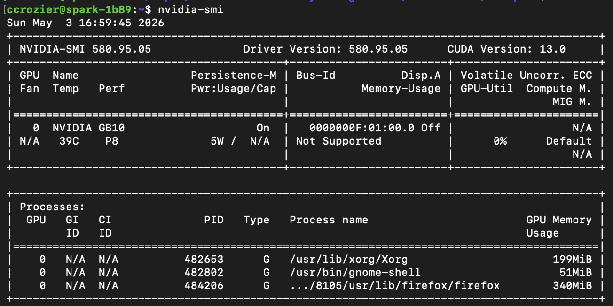
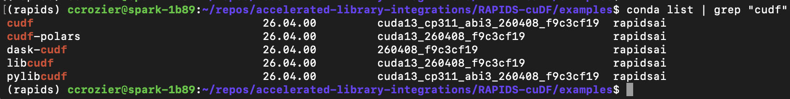
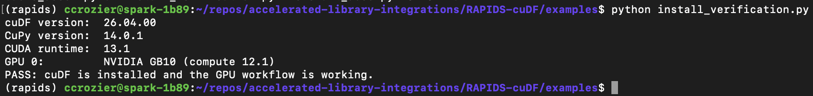
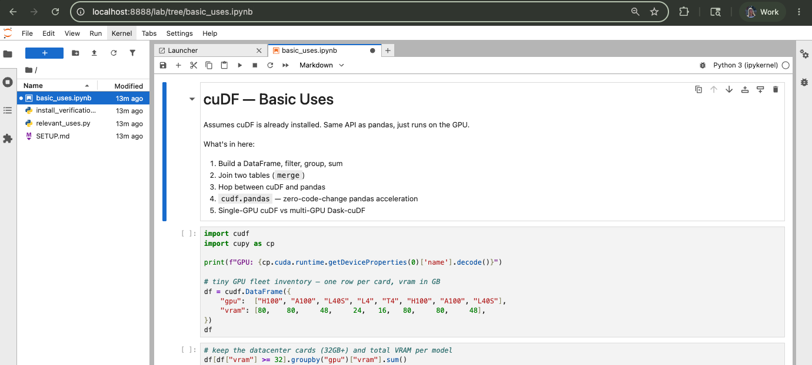
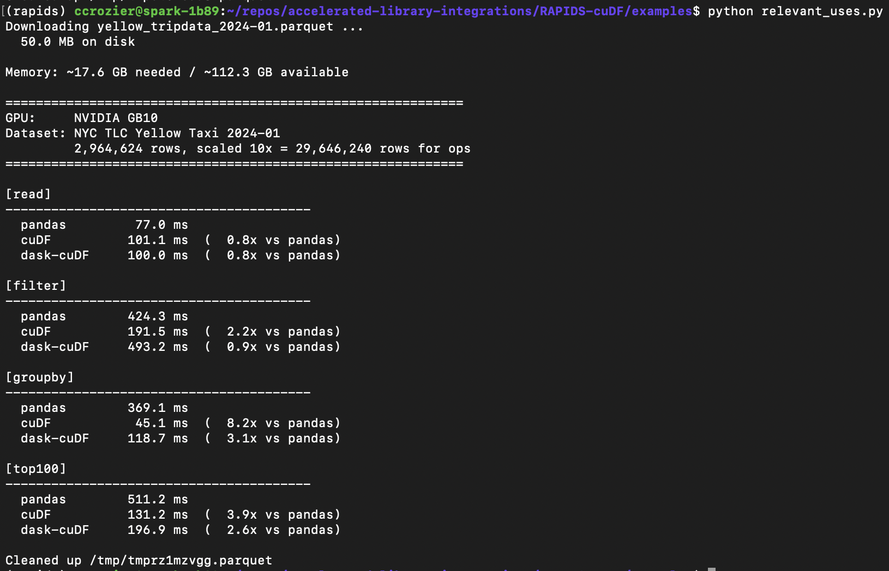
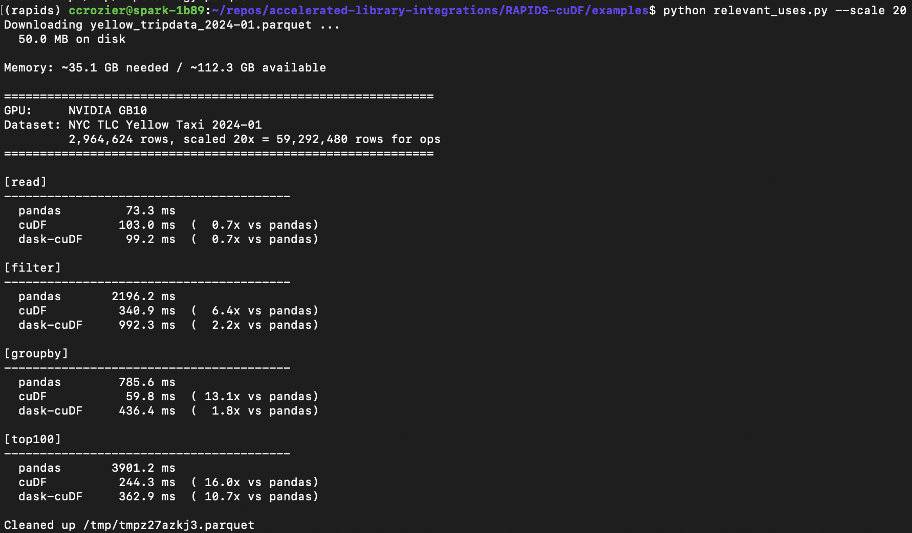

# Setup & Run

Step-by-step walkthrough for setting up cuDF on NVIDIA GPU and running the examples within /examples. Screenshots are from a DGX Spark (GB10).

## 1. Verify the GPU

```bash
nvidia-smi
```



## 2. Clone the repo

```bash
gh auth login           # use SSH auth
git clone <repo-url>
cd accelerated-library-integrations/RAPIDS-cuDF
```

## 3. Create the conda env and install cuDF + Dask-cuDF

```bash
conda create -n rapids
conda init
conda activate rapids

conda install -c rapidsai libcudf
conda install -c rapidsai pylibcudf
conda install -c rapidsai cudf
conda install -c rapidsai cudf-polars
conda install -c rapidsai dask-cudf
```



## 4. Verify the install

```bash
python install_verification.py
```



## 5. Run the basic-uses notebook

Install JupyterLab if you haven't:

```bash
conda install -c conda-forge jupyterlab
```

On the remote, launch the notebook (no browser needed there):

```bash
jupyter lab --no-browser --ip=127.0.0.1 --port=8888 basic_uses.ipynb
```

On your local machine, forward the port:

```bash
ssh -N -L 8888:localhost:8888 <username>@<remote-host>
```

Then open `http://localhost:8888/` in your local browser and paste the token from the Jupyter output.



## 6. Run the benchmark

```bash
python relevant_uses.py             # default --scale 10 (~30M rows)
python relevant_uses.py --scale 20  # ~60M rows for a heavier comparison
```

cuDF's lead grows with scale. At `--scale 10` the wins are modest; at `--scale 20` cuDF lands in the 5–15x range on the heavier ops.

**Default `--scale 10` (~30M rows):**



**Scaled `--scale 20` (~60M rows):**

